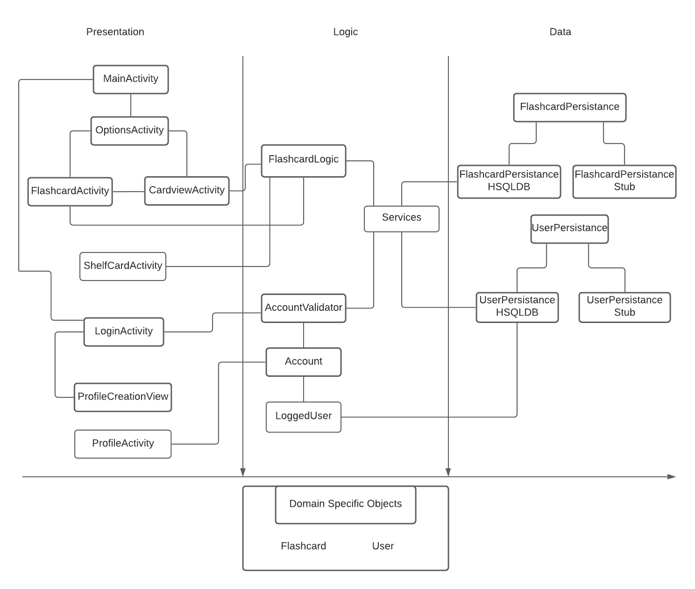

# Architecture

 Our Flashcard Study application is based on a three tier architecture. The tiers are Presentation tier, 
Logic Tier, Data Tier. In addition to that we also have a Objects package and an application package.

## Application

 Is the place which is used to launch the application.  
This package includes: 
[MainActivity](https://code.cs.umanitoba.ca/3350-winter-2021-a02/group5/-/blob/master/app/src/main/java/flashcard/group5/application/MainActivity.java)  
    * For now just shows the initial interface when the app launches, with the applications name on top. 
[Services](https://code.cs.umanitoba.ca/3350-winter-2021-a02/group5/-/blob/master/app/src/main/java/flashcard/group5/application/Services.java)  
    *The class that deals with the Persistance layer for FlashcardLogic and AccountValidator

## Presentation Tier

 The presentation tier is the user interface and communication layer of the application, where the 
end user interacts with the application. Its main purpose is to display information to and collect information from the user. 
This package includes:  
[CardviewActivity](https://code.cs.umanitoba.ca/3350-winter-2021-a02/group5/-/blob/master/app/src/main/java/presentation/CardviewActivity.java)  
[FlashcardActivity](https://code.cs.umanitoba.ca/3350-winter-2021-a02/group5/-/blob/master/app/src/main/java/presentation/FlashcardActivity.java)  
[LoginActivity](https://code.cs.umanitoba.ca/3350-winter-2021-a02/group5/-/blob/master/app/src/main/java/presentation/LoginActivity.java)  
[ProfileActivity](https://code.cs.umanitoba.ca/3350-winter-2021-a02/group5/-/blob/master/app/src/main/java/presentation/ProfileActivity.java)  
[ShelfcardActivity](https://code.cs.umanitoba.ca/3350-winter-2021-a02/group5/-/blob/master/app/src/main/java/presentation/ShelfcardActivity.java)  
[OptionsActivity](https://code.cs.umanitoba.ca/3350-winter-2021-a02/group5/-/blob/master/app/src/main/java/presentation/OptionsActivity.java)  
[ProfileCreationView](https://code.cs.umanitoba.ca/3350-winter-2021-a02/group5/-/blob/master/app/src/main/java/presentation/ProfileCreationView.java)  

## Logic Tier

 Information collected in the presentation tier is processed. 
This package includes: 
[FlashcardLogic](https://code.cs.umanitoba.ca/3350-winter-2021-a02/group5/-/blob/master/app/src/main/java/logic/FlashcardLogic.java)  
[AccountValidator](https://code.cs.umanitoba.ca/3350-winter-2021-a02/group5/-/blob/master/app/src/main/java/logic/AccountValidator.java)  
[Account](https://code.cs.umanitoba.ca/3350-winter-2021-a02/group5/-/blob/master/app/src/main/java/logic/Account.java)  
[LoggedUser](https://code.cs.umanitoba.ca/3350-winter-2021-a02/group5/-/blob/master/app/src/main/java/logic/LoggedUser.java)  

## Data Tier

 The Data Tier is where the information processed by the application is stored and managed. 
This package includes: 
HSQLDB: 
[FlashcardPersistenceHSQLDB](https://code.cs.umanitoba.ca/3350-winter-2021-a02/group5/-/blob/master/app/src/main/java/data/hsqldb/FlashcardPersistenceHSQLDB.java)  
[UserPersistenceHSQLDB](https://code.cs.umanitoba.ca/3350-winter-2021-a02/group5/-/blob/master/app/src/main/java/data/hsqldb/UserPersistenceHSQLDB.java)  
Stubs: 
[FlashcardPersistenceStub](https://code.cs.umanitoba.ca/3350-winter-2021-a02/group5/-/blob/master/app/src/main/java/data/stubs/FlashcardPersistenceStub.java)  
[UserPersistenceStub](https://code.cs.umanitoba.ca/3350-winter-2021-a02/group5/-/blob/master/app/src/main/java/data/stubs/UserPersistenceStub.java)  

## Objects

 This package contains the information of the various objects to be used by the rest of the project. 
This package includes: 
[Flashcard](https://code.cs.umanitoba.ca/3350-winter-2021-a02/group5/-/blob/master/app/src/main/java/objects/Flashcard.java) 
    *Representing the front and back side of a card. 
[User](https://code.cs.umanitoba.ca/3350-winter-2021-a02/group5/-/blob/master/app/src/main/java/objects/User.java) 
    *Represents the informations of the user

## Iteration 2 Diagram 

