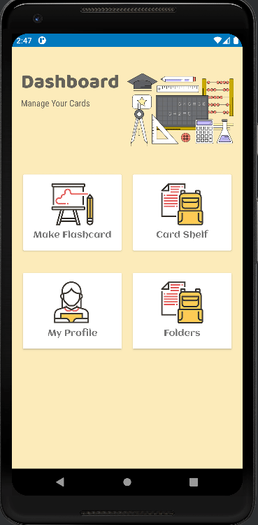

## Reversible Learning


**Reversible Learning** is a comprehensive study application tailored for students and lifelong learners. It's designed to assist users in organizing class notes across multiple subjects, archiving past questions, and ensuring that knowledge remains accessible for future reference.

### Features
- **Organize Notes**: Create, edit, and organize notes for as many classes or subjects as you need.
- **Archive Questions**: Store past questions and answers, making revision more efficient.
- **Flashcards**: Use the built-in flashcard system to test your knowledge and improve memory retention.
- **Custom Tests**: Create custom tests from your flashcards, with optional timers to simulate exam conditions.

### How It Works
Reversible Learning operates on a three-tier architecture:

1. **Presentation Tier**: This is the user interface layer where users interact with the application. It displays information and collects user inputs.
2. **Logic Tier**: This layer processes the information collected in the presentation tier, handling the business logic of the application.
3. **Data Tier**: Responsible for storing and managing the application's data. It utilizes HSQLDB for persistent data storage.

### Team Members
- Scott Isfeld
- Leonardo Warsito
- Chowdhury Abdul Mumin Ishmam
- Saif Mahmud
- Yelizaveta Yashin
- Syed Ali Ahsen Muhammad Jafry

### Key Documents
- [Vision Statement](https://github.com/vmsaif/reversibleLearning/blob/master/VISION.md)
- [Architecture Overview](https://github.com/vmsaif/reversibleLearning/blob/master/Documents/Architecture.md)

### Getting Started

#### Prerequisites
- Android Studio (latest version recommended)
- Nexus 7 emulator or device with API 30

#### Cloning the Repository
1. Open your terminal or command prompt.
2. Navigate to the directory where you want to clone the repository.
3. Run the following command:

```bash
git clone https://github.com/vmsaif/reversibleLearning.git
```

#### Setting Up
1. Open Android Studio.
2. Click on `Open an existing Android Studio project`.
3. Navigate to the directory where you cloned the repository and select it.

#### Running the Application
1. Ensure you have the Nexus 7 emulator set up or connect your Nexus 7 device with USB debugging enabled.
2. Build the project by selecting `Build` > `Build Project` from the top menu.
3. Once the build is complete, click on the green play button (or `Run` > `Run 'app'`) to start the application.
4. Choose the Nexus 7 emulator or device from the list and wait for the app to launch.

### Visual Overview

